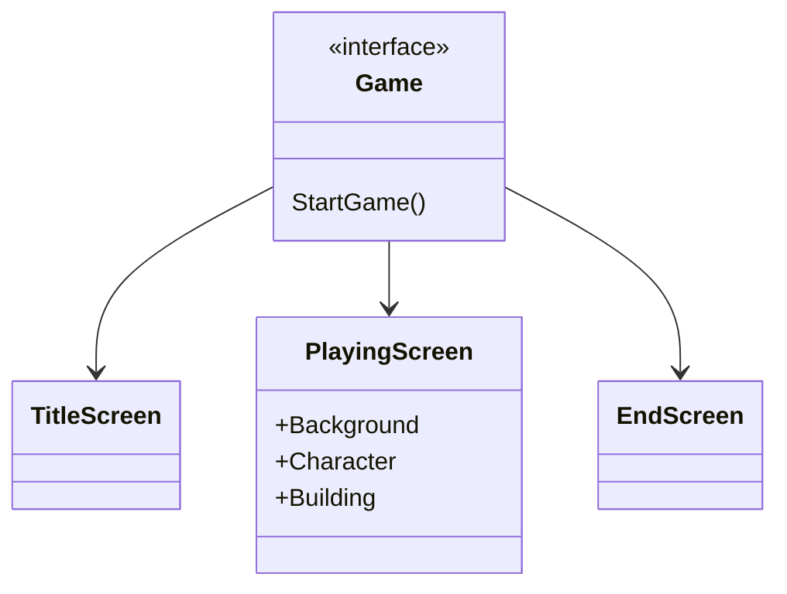
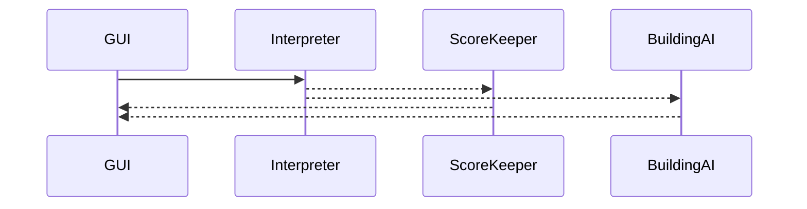
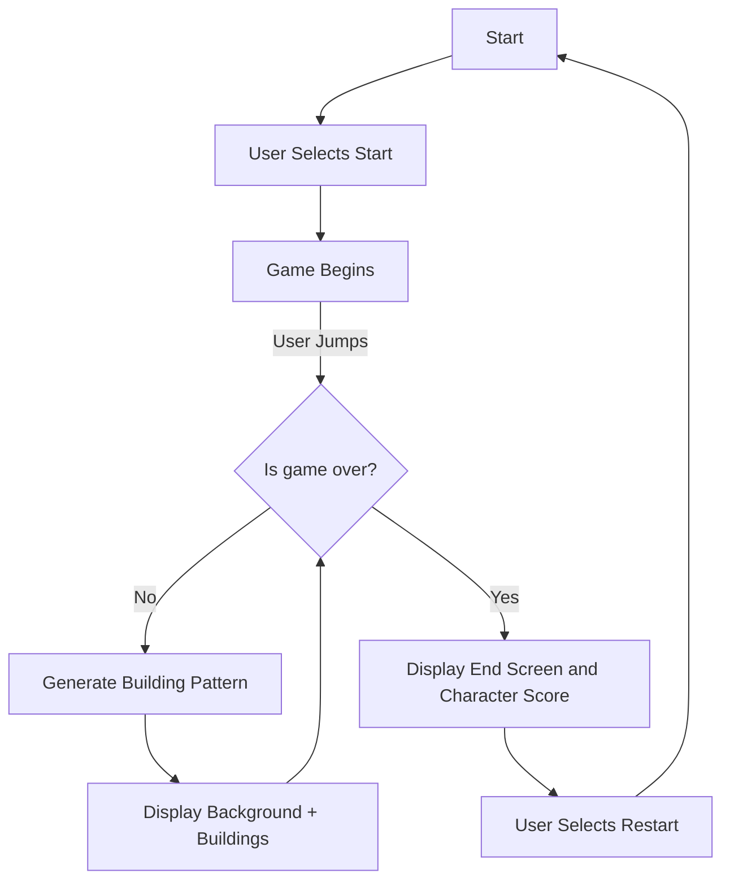

# skyRunner platform game

Brief Description: You are a character that is running on top of buildings in the city. The object of the game is to get as far as you can while jumping over the cracks/spaces between the buildings. In order to jump you must press the enter key. If you fall in the crack of the buildings the game is over and displays your score, which is based on how many buildings you hit.

## How to run the code
1) Make sure you have npm installed
2) Make sure you have node installed
3) Run 'npm install'
4) Run 'npm install -g node-gyp'
5) Run 'node-gyp configure build'
6) Run 'node server.js'
7) Open [http://localhost:3001/start]

### Class Diagram for GUI

This gives an overall view of the different components and how they will be organized for the game interface. There is a top level game container that has the three different screen displays depending on the state of the game (title, game, end screen).

#### Sequence Diagram

This shows how the GUI (defined above) will make calls to the backEnd server in order to get the game logic regarding keeping track of highest score and the game logic regarding generating the next set of buildings (platform).

### Activity Diagram

This shows how the user actions and game logic will fundamentally interact. The user clicks start on the title page and then the game continues until the user dies. The game updates with randomized buildings and gap distances between buildings.
