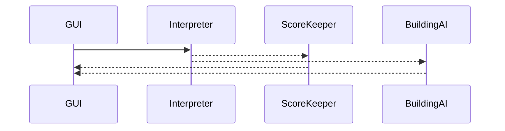
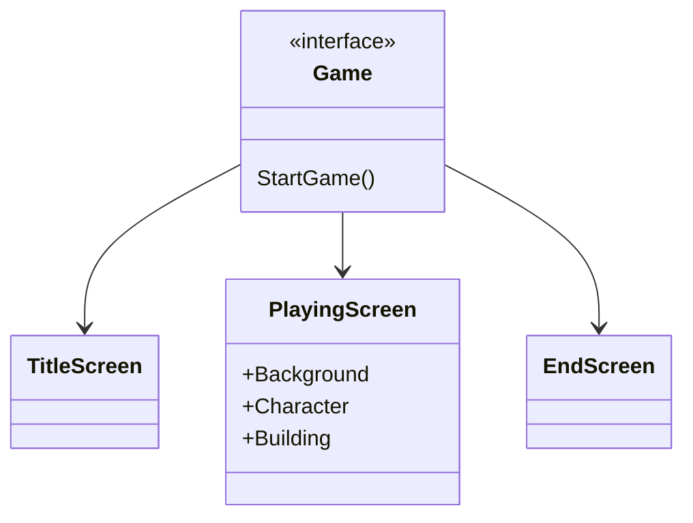
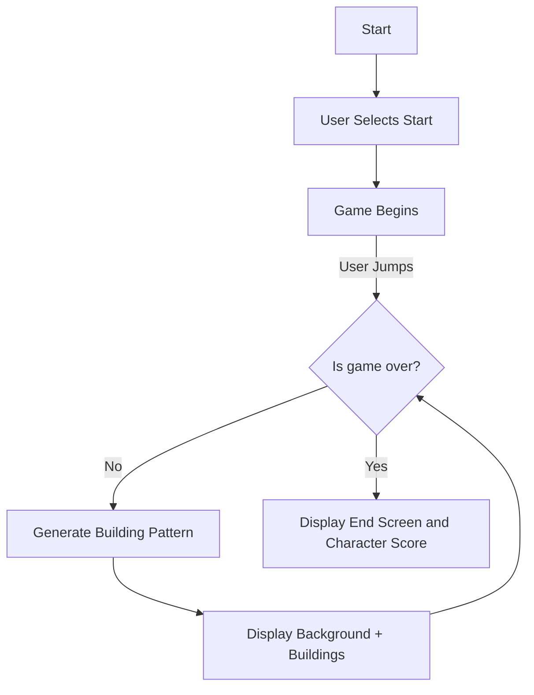

# skyRunner

## You can run the code the following two ways:

## One:

### A. Install the visual studio code "open in browser" extension 

### B. Navigate to <placeHolder.html>

### C. Have a supported browser open

### D. Press `⌘k w` to open it on your browser

## Two:

### A. Go to your Finder/File Explorer

### B. Navigate to the skyRunner repository you cloned

### C. Select the <placeHolder>.html file and it will open in your browser

More information can be found on the README.md file under the sky-runner directory.
