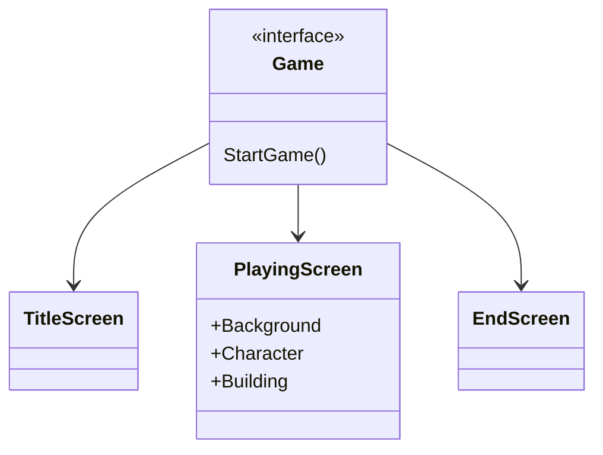
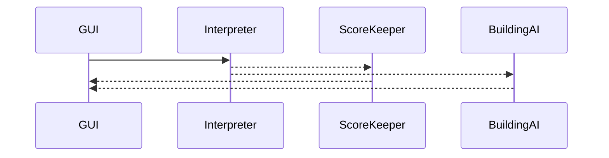
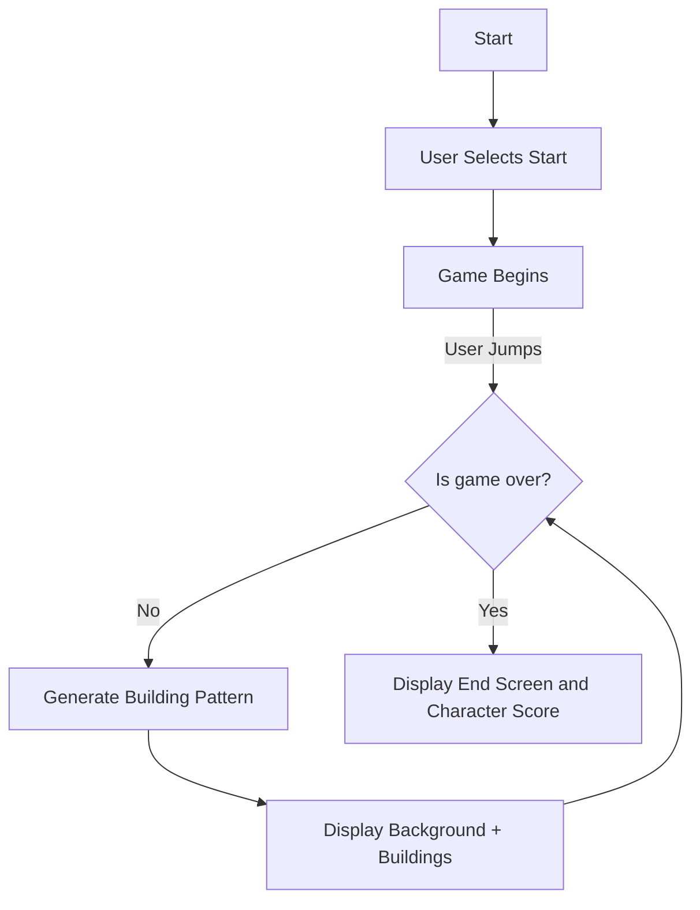

# skyRunner platform game

Brief Description: You are a character that is running on top of buildings in the city. The object of the game is to get as far as you can while jumping over the cracks/spaces between the buildings.

## You can run the code the following two ways:

## One:

    A. Install the visual studio code "open in browser" extension 

    B. Navigate to <placeHolder.html>

    C. Have a supported browser open

    D. Press `⌘k w` to open it on your browser

## Two:

    A. Go to your Finder/File Explorer

    B. Navigate to the skyRunner repository you cloned

    C. Select the <placeHolder>.html file and it will open in your browser

#### Class Diagram for GUI

This gives an overall view of the different components and how they will be organized for the game interface.

#### Sequence Diagram 

This shows how the GUI (defined above) will make calls to the backEnd server in order to get the game logic regarding keeping track of highest score and the game logic regarding generating the next set of buildings (platform).

### Activity Diagram:

This shows how the user actions and game logic will fundamentally interact.
